## Содержание

* [1. Установка приложения](#1-установка-приложения)
* [2. Первое подключение](#2-первое-подключение)
* [3. Главный экран приложения](#3-главный-экран-приложения)
    * [3.1. Настройки сиденья](#31-настройки-сиденья)
        * [3.1.1. Пользовательский режим](#311-пользовательский-режим)
        * [3.1.2. Стандартный режим](#312-стандартный-режим)
        * [3.1.3. Автоподогрев](#313-автоподогрев)
            * [3.1.3.1. Умный режим](#3131-умный-режим)
            * [3.1.3.2. Расширенный режим](#3132-расширенный-режим)
* [4. Экран настроек](#4-экран-настроек)
    * [4.1. Настройки приложения](#41-настройки-приложения)
        * [4.1.1. Основные](#411-основные)
        * [4.1.2. Виджеты](#412-виджеты)
        * [4.1.3. Разрешения](#413-разрешения)
        * [4.1.4. Сброс настроек](#414-сброс-настроек)
    * [4.2. Настройки устройств](#42-настройки-устройств)
        * [4.2.1. Система](#421-система)
        * [4.2.2. Сеть](#422-сеть)
        * [4.2.3. Безопасность](#423-безопасность)
        * [4.2.4. Сброс настроек](#424-сброс-настроек-1)
        * [4.2.5. Обновления](#425-обновления)
            * [4.2.5.1. Обновление приложения](#4251-обновление-приложения)
            * [4.2.5.2. Обновление устройств](#4252-обновление-устройств)
        * [4.2.6. Статистика устройств](#426-статистика-устройств)

---

## 1. Установка приложения

> [!WARNING] Важно
> *Приложение можно установить только на ГУ с модифицированным ПО (Lunaris/GMC), либо на android-приставку (некоторые модели). Для телефонов приложение не адаптировано.*

Установить приложение можно через любой файловый менеджер, установленный в ГУ или android-приставке. Сразу после установки приложения откроется окно системных настроек, в котором нужно разрешить **доступ к отображению поверх остальных приложений**  (требуется для корректной работы виджетов) и **доступ к местоположению**  (требуется для определения Wi-Fi сетей).

Через настройки приложения необходимо выдать еще одно разрешение — на **доступ к данным использования приложений**  (также требуется для работы виджетов).

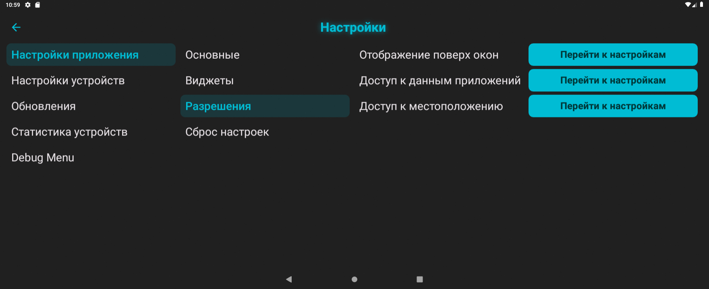

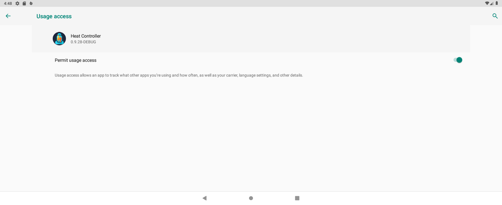

**Доступ к местоположению:**

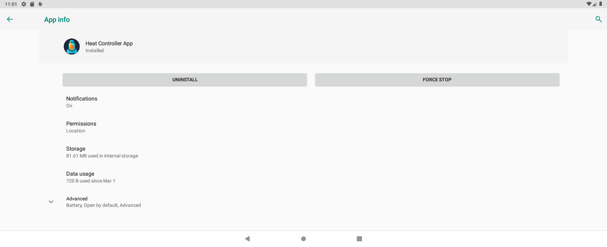

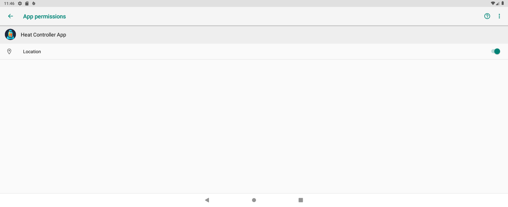

Если сразу после установки приложения окно настроек разрешений не открылось автоматически, то все три разрешения необходимо выдать вручную.

Смотреть видео по установке приложения

  <iframe width="100%" height="315"
    src="https://rutube.ru/play/embed/7462fe365174178976a379ac63c9f290/?p=Bu6xyZXosh1dEnJ6hng2tg"
    frameBorder="0"
    allow="clipboard-write; autoplay"
    webkitAllowFullScreen mozallowfullscreen allowFullScreen>
  </iframe>

---

## 2. Первое подключение

Процедура первого запуска и конфигурации (порядок действий для Android-приставок аналогичный):

1. Заглушить двигатель *(если плата одна, то пропустить шаги 2-8)*.
2. Заменить плату заднего ряда.
3. Завести двигатель.
4. Включить в настройках ГУ Wi-Fi и открыть поиск доступных сетей.
5. В списке найденных сетей выбрать и подключиться к сети **«HeatControllerMaster»**  (пароль `heat0000`).
6. Открыть приложение **Heat Controller App** и убедиться, что подключение установлено (карточки сидений на главном экране должны быть активными).
7. Перейти в **«Настройки»** -> **«Настройки устройств»** -> **«Система»**, изменить **Роль** на **«Ведомый»**, а **Расположение** на **«Задний ряд»**, нажать кнопку **«Сохранить и перезагрузить»**. Контроллер перезагрузится, при этом соединение будет прервано.
8. Заглушить двигатель.
9. Заменить плату переднего ряда.
10. Завести двигатель.
11. Включить в настройках ГУ Wi-Fi и открыть поиск доступных сетей.
12. В списке найденных сетей выбрать и подключиться к сети **«HeatControllerMaster»**  (пароль `heat0000`).
13. Открыть приложение **Heat Controller App** и убедиться, что подключение установлено (карточки сидений на главном экране должны быть активными).
14. Перейти в **«Настройки»** -> **«Настройки устройств»** -> **«Сеть»**, нажать кнопку **«Поиск сетей»**, дождаться окончания поиска, выбрать домашнюю сеть *(например, сеть телефона в режиме модема или сеть автомобильного роутера)*, ввести пароль и нажать кнопку **«Подключить»** (плата перезагрузится и автоматически подключится к выбранной сети).
15. Включить в настройках ГУ Wi-Fi и открыть поиск доступных сетей.
16. В списке найденных сетей выбрать и подключиться к той же сети, к которой только что была подключена плата переднего ряда (Master).
17. Открыть приложение **Heat Controller App** и убедиться, что подключение установлено (карточки сидений на главном экране должны быть активными). Статус подключения можно проверить, если перейти в **«Настройки»** -> **«Настройки устройств»** -> **«Сеть»**  — над кнопкой «Поиск сетей» будет отображаться текущее подключение.
18. Выполнить настройку плат по желанию.

Смотреть виде по подключению контроллера к домашней сети

  <iframe width="100%" height="315"
    src="https://rutube.ru/play/embed/596e097871423c35134a902e6f4d47bb/?p=7p0D27QFteZq8nkqmZi6Yg"
    frameBorder="0"
    allow="clipboard-write; autoplay"
    webkitAllowFullScreen mozallowfullscreen allowFullScreen>
  </iframe>

---

## 3. Главный экран приложения

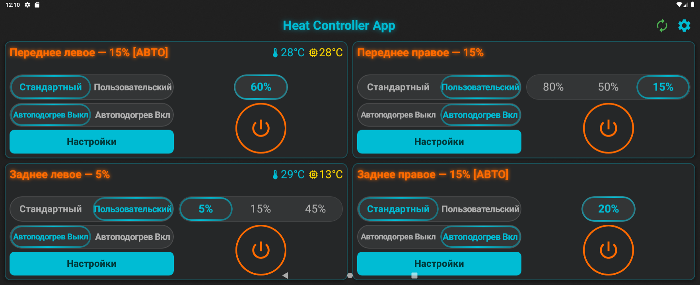

Главный экран приложения (дашборд) выполнен в виде четырех независимых блоков (карточек), содержащих элементы управления, текущее состояние и настройки каждого сиденья. В пользовательском режиме для каждого сиденья отображаются два или три уровня мощности — в зависимости от выбранной настройки.

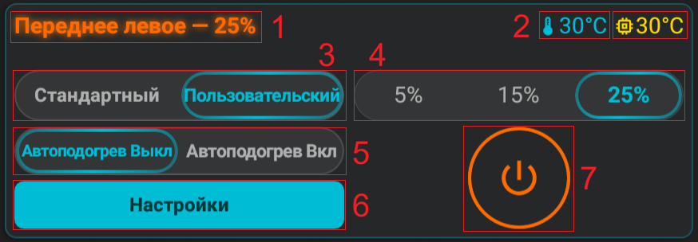

**Элементы индикации и управления:**
1. Название сиденья и текущая фактическая мощность нагревателя.
2. Индикатор температуры воздуха в салоне и температуры платы *(для настройки автоподогрева необходимо ориентироваться именно на температуру воздуха в салоне)*.
3. Переключатель режимов «Стандартный» / «Пользовательский».
4. Переключатель двух или трёх уровней мощности.
5. Выключатель функции автоподогрева.
6. Кнопка «Настройки».
7. Кнопка-индикатор ручного включения нагрева.

### 3.1. Настройки сиденья

Кнопка «Настройки» открывает окно настроек нагревателя соответствующего сиденья.

> [!INFO] Сохранение настроек
> *Настройки сохраняются либо через 3 секунды после изменений, либо при выходе из окна настроек. Изменения настроек автоподогрева (в том числе во время его работы) применяются только при следующем его включении.*

#### 3.1.1. Пользовательский режим

Здесь можно независимо для каждого сиденья выбрать два или три уровня мощности и настроить значение каждого активного уровня в диапазоне от 5% до 100%.

При выборе **«2 уровня»** используются уровни 1 и 2, а третий уровень скрывается и не участвует в переключении. При выборе **«3 уровня»** доступны все три уровня. Если подключённая прошивка не поддерживает выбор количества уровней, соответствующий список не отображается и используются три уровня.

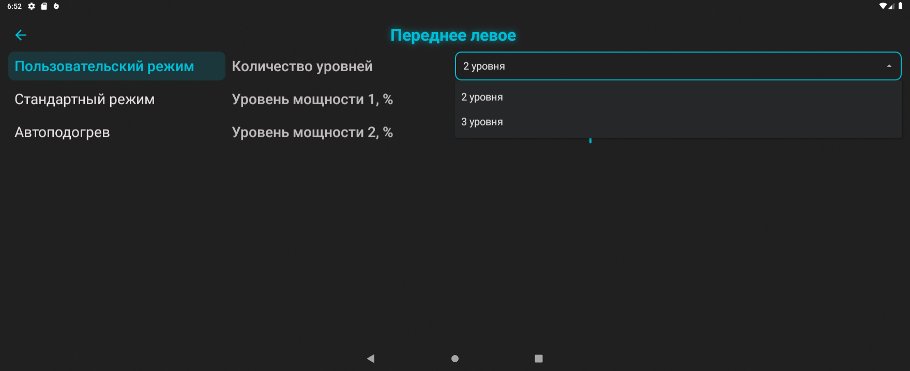

#### 3.1.2. Стандартный режим

Здесь можно настроить желаемую мощность для единственного уровня подогрева в диапазоне от 5% до 100%.

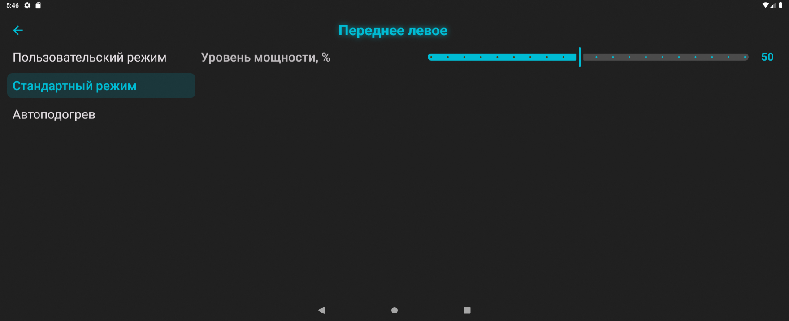

#### 3.1.3. Автоподогрев

Эта вкладка предназначена для настройки функции автоподогрева. Автоподогрев может работать в двух режимах: **«Умный»** и **«Расширенный»**.

##### 3.1.3.1. Умный режим

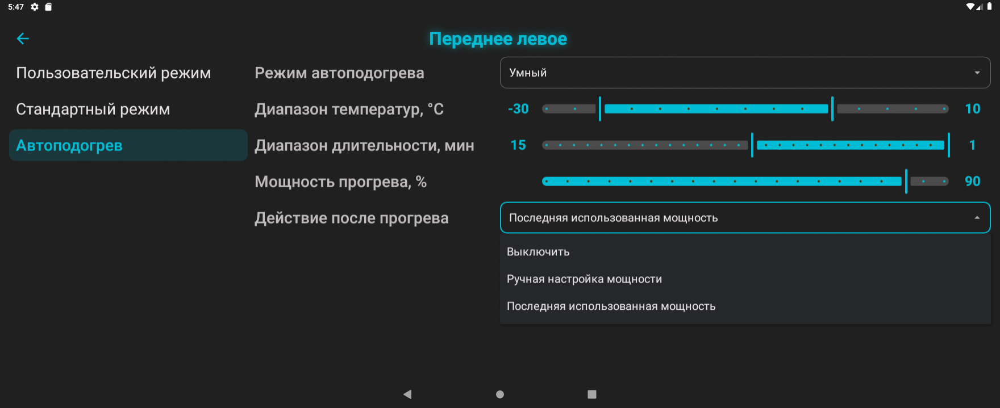

* **Диапазон температур** — это диапазон, в котором работает функция автоподогрева;
* **Диапазон длительности** — это диапазон значений времени «Прогрева», соответствующий установленному диапазону температур;
* **Мощность прогрева** — это мощность, с которой нагреватель будет прогревать сиденье при автоматическом включении;
* **Действие после прогрева** — это действие, которое автоматически выполнится по окончанию фазы прогрева.

> [!INFO] Прогрев
> *Прогрев — это фаза интенсивной работы нагревателя на повышенной мощности, целью которой является ускорение нагрева самого сиденья.*
>
> *Например, в соответствии с настроенными значениями на изображении выше, автоподогрев может включаться при температуре от -30°C до +10°C. При температуре -30°C фаза интенсивного прогрева будет работать в течение 15 минут на мощности 90%, а при температуре +10°C прогрев будет работать в течение 1 минуты на мощности 90%. После завершения фазы прогрева нагреватель либо выключится, либо перейдет на мощность, установленную вручную, либо переключится на мощность, использованную в последней поездке. Если температура выше +10°C градусов, то автоподогрев уже не включится. Температура измеряется в момент запуска двигателя.*

##### 3.1.3.2. Расширенный режим

* **Условие включения** — либо включается всегда вне зависимости от температуры салона, либо включается только при температуре ниже установленной;
* **Мощность прогрева** — это мощность, с которой нагреватель будет прогревать сиденье при автоматическом включении;
* **Длительность прогрева** — это время работы нагревателя на повышенной мощности;
* **Условие выключения** — нагрев выключается либо по таймеру, либо по температуре, либо не выключается вообще;
* **Действие после прогрева** — это действие, которое автоматически выполнится по окончанию фазы прогрева.

> [!INFO] Индикация AUTO
> *При работающем автоподогреве на дашборде (в блоке соответствующего сиденья) рядом с названием сиденья будет отображаться текст `[AUTO]` и оставшееся время работы автоподогрева (если это время ограничено настройками).*

---

## 4. Экран настроек

### 4.1. Настройки приложения

#### 4.1.1. Основные

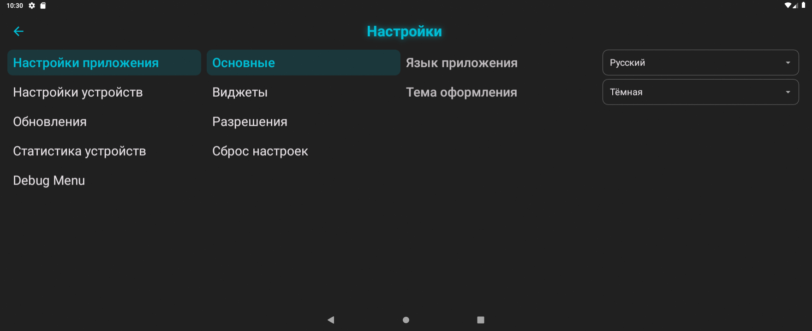

Здесь можно изменить язык приложения и выбрать тему оформления.

#### 4.1.2. Виджеты

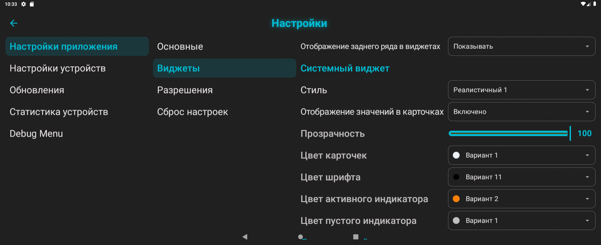

В этой вкладке расположены настройки виджетов приложения.

* **Задний ряд в виджете** — настройка, позволяющая скрыть отображение сидений заднего ряда в виджетах. Актуально для тех, у кого установлена только одна кастомная плата. Если не скрывать задний ряд, то пиктограммы задних сидений будут всегда отображаться полупрозрачными (как неактивные).
* **Системный виджет** — виджет текущего состояния подогревов, который подходит для отображения на главном экране системного лаунчера ГУ. Он **не** отображается поверх запущенных приложений. Имеет три варианта визуального оформления (Упрощенный / Реалистичный 1 / Реалистичный 2), а также может быть полностью отключен.
* **Динамический виджет** — виджет-уведомление, который отображается в течение трех секунд поверх всех запущенных приложений при нажатиях на физические кнопки подогрева. Имеет два варианта визуального оформления (Упрощенный / Реалистичный), а также может быть полностью отключен.

*Примечание: Для каждого виджета можно скрыть отображение числовых значений мощности в карточках.*

#### 4.1.3. Разрешения

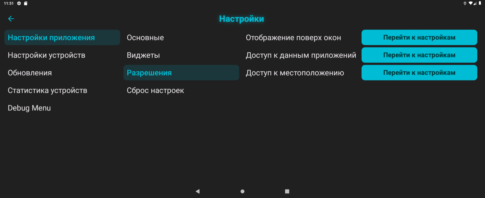

* **Отображение поверх окон**, **Доступ к статистике приложений** и **Доступ к местоположению** — это быстрые ссылки на системные настройки ГУ, где необходимо выдать эти разрешения для корректной работы приложения.

#### 4.1.4. Сброс настроек

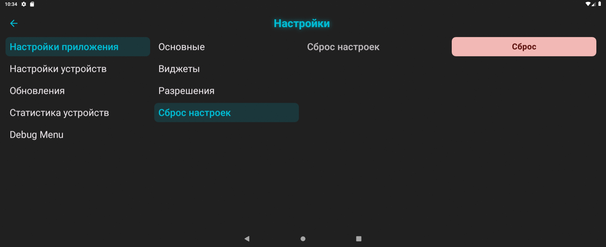

Кнопка «Сброс» после дополнительного подтверждения возвращает все настройки приложения к настройкам по умолчанию.

---

### 4.2. Настройки устройств

#### 4.2.1. Система

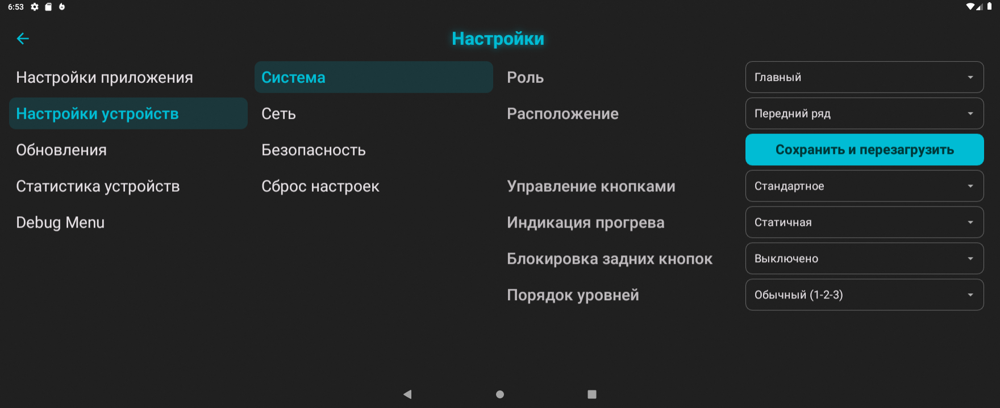

На данной вкладке можно настроить базовые параметры работы устройства:

* **Роль** — настройка, которая позволяет назначить одну из плат в качестве главной (Master), а вторую в качестве ведомой (Slave). Актуально только при использовании двух плат.
* **Расположение** — настройка, которая определяет расположение сидений этой платы на виджетах с учетом фактического её расположения в автомобиле. *(Например, можно использовать одну плату для заднего ряда, несмотря на то, что программно она может являться главной)*.

> [!WARNING] Важно
> *От параметров «Роль» и «Расположение» зависит базовый функционал прошивки. После их изменения необходимо обязательно нажать кнопку **«Сохранить и перезагрузить»**.*

* **Управление кнопками** — позволяет выбрать одну из схем взаимодействия с физическими кнопками подогрева:
  * **Стандартное:** всё управление осуществляется одиночными нажатиями по кругу. Для двух уровней используется цикл «Уровень 1 -> Уровень 2 -> Выкл» либо «Уровень 2 -> Уровень 1 -> Выкл» при инвертированном порядке. Для трёх уровней используются циклы «Уровень 1 -> Уровень 2 -> Уровень 3 -> Выкл» и «Уровень 3 -> Уровень 2 -> Уровень 1 -> Выкл». В стандартном режиме используется схема «Вкл -> Выкл».
  * **Альтернативное:**
    * длинное нажатие — включает/выключает нагрев;
    * короткое одиночное нажатие — включает первый уровень мощности;
    * короткое двойное нажатие — включает второй уровень мощности;
    * короткое тройное нажатие — включает третий уровень мощности, если для сиденья выбраны три уровня.
    * параметр **«Порядок уровней»** не меняет прямой выбор уровня по количеству коротких нажатий, а влияет прежде всего на стандартный циклический режим и отображение.
* **Индикация прогрева** — изменение визуального стиля светодиодной индикации на физических кнопках управления во время фазы автоматического прогрева.
* **Блокировка задних кнопок** — при значении **«Включено»** физические нажатия на кнопки задней платы игнорируются. Управление задними сиденьями из приложения, виджетов и веб-интерфейса остаётся доступным, а уже включённый нагрев не выключается. Настройка доступна на главной плате, применяется и сохраняется сразу; нажимать **«Сохранить и перезагрузить»** для неё не требуется.
* **Порядок уровней** — задаёт порядок отображения и переключения активных уровней в приложении, системном и динамическом виджетах, а также на физических кнопках контроллера. Для двух уровней используются порядки «1 -> 2» и «2 -> 1», для трёх — «1 -> 2 -> 3» и «3 -> 2 -> 1». Индикация всегда соответствует фактически выбранному уровню, без обратного пересчёта.

#### 4.2.2. Сеть

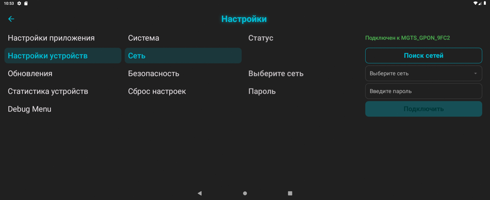

Вкладка предназначена для настройки подключения плат к домашней сети *(не путайте с системными настройками Wi-Fi самого ГУ!)*.

Чтобы подключить плату, например, к точке доступа на мобильном телефоне, нужно нажать «Поиск сетей», выбрать нужную сеть из выпадающего списка, а затем ввести пароль. После этого плата перезагрузится и подключится к указанной сети. В строке «Статус» будет отображаться имя выбранной сети.

#### 4.2.3. Безопасность

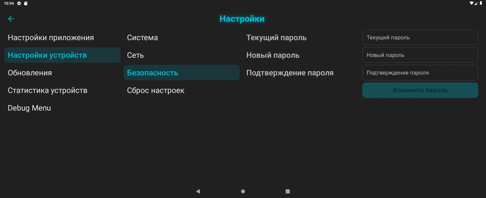

Здесь можно изменить пароль точки доступа(AP) самой платы. Для изменения потребуется ввести текущий пароль, затем дважды ввести новый и нажать кнопку «Изменить пароль».

> [!INFO] Пароль по умолчанию
> *На всех платах пароль точки доступа по умолчанию — `heat0000`.*

#### 4.2.4. Сброс настроек

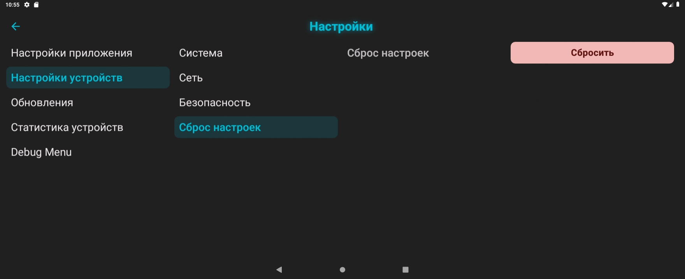

Нажатие кнопки «Сбросить» на этой вкладке приведет к восстановлению всех настроек платы к заводским значениям.
*Примечание: Данный сброс не затрагивает параметры «Роль», «Расположение» и «Сеть».*

#### 4.2.5. Обновления

##### 4.2.5.1. Обновление приложения

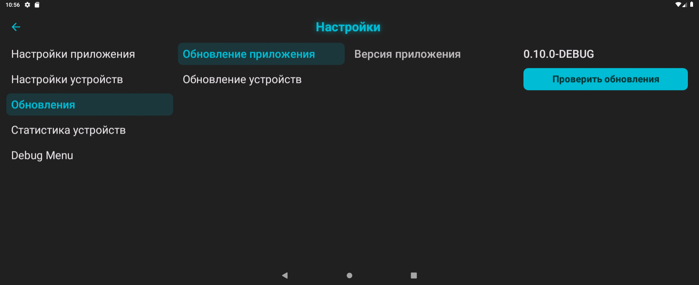

Наличие обновлений для самого приложения проверяется автоматически при подключении к сети Wi-Fi с доступом в интернет. Также его можно проверить вручную нажатием на кнопку **«Проверить обновления»**.

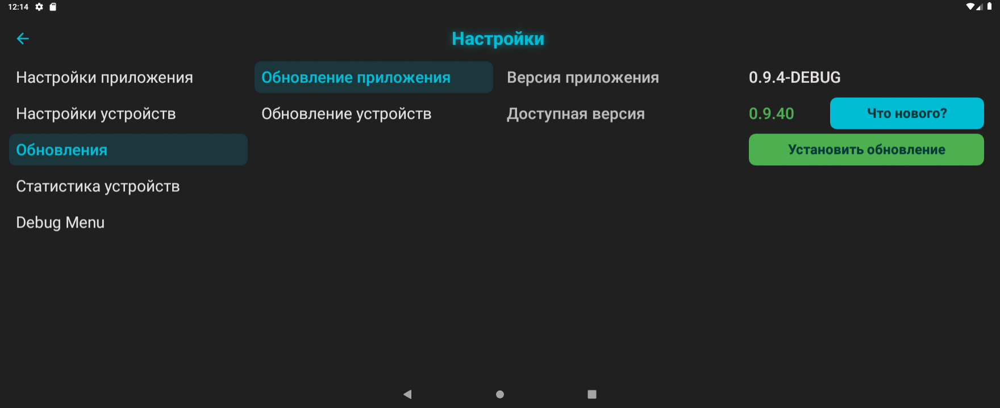

При наличии новой версии появятся кнопки **«Что нового?»** *(описание изменений)* и **«Установить обновление»**. Нажатие на эту кнопку запускает процесс скачивания `.apk` файла с сервера и его установки. Все текущие настройки приложения при этом полностью сохраняются.

##### 4.2.5.2. Обновление устройств

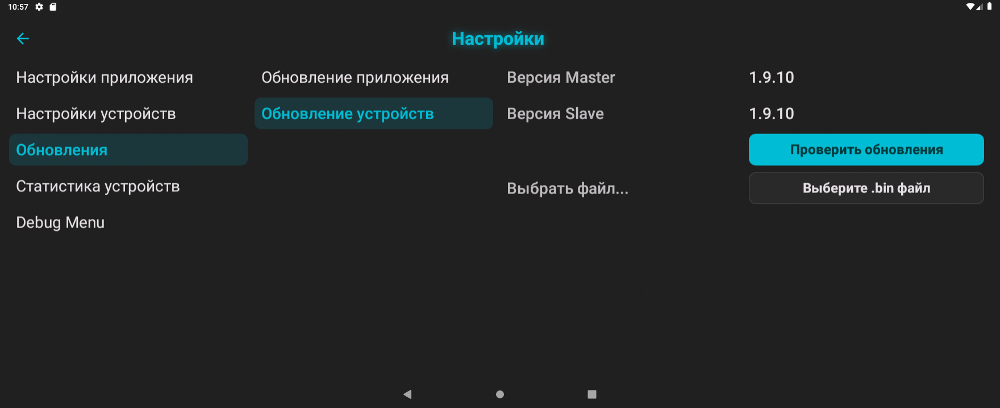

Если в автомобиле используются две платы, здесь будет отображаться информация о версии как главной платы *(Master)*, так и ведомой *(Slave)*. Если используется только одна плата, будет доступна информация только о главной.

Наличие обновления прошивки плат проверяется автоматически при выходе в интернет через Wi-Fi, а также при нажатии кнопки **«Проверить обновления»**.

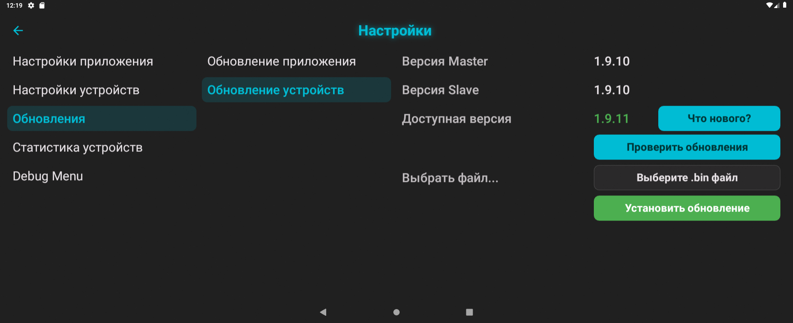

При наличии обновления отобразятся кнопки **«Что нового?»** и **«Установить обновление»**. Последняя кнопка запускает процесс скачивания файла прошивки(`.bin`) с сервера и его установки. *Если в автомобиле установлены две платы, их прошивка обновится последовательно — сначала ведомая, затем главная.* Настройки устройств при этом сохраняются.

**Ручное обновление прошивки (offline):**
При отсутствии возможности прямого подключения к интернету, предусмотрен ручной метод прошивки:
* Заранее скачайте `.bin` файл новой прошивки с компьютера/телефона;
* Сохраните скачанный файл на USB-флешку;
* Подключите флешку в левый USB-разъем автомобиля;
* На вкладке «Обновление устройств» нажмите кнопку **«Выбрать файл»** и найдите требуемый `.bin` файл через появившийся файловый менеджер;
* Нажмите кнопку **«Установить обновление»** — начнется процесс обновления прошивки, аналогичный процессу онлайн-обновления.

#### 4.2.6. Статистика устройств

В этом разделе сгруппирована системная информация о состоянии подключенных устройств.
