## Содержание

* [1. Первое подключение и настройка плат](#1-первое-подключение-и-настройка-плат)
* [2. Установка приложения](#2-установка-приложения)
* [3. Главный экран приложения](#3-главный-экран-приложения)
    * [3.1. Настройки сиденья](#31-настройки-сиденья)
        * [3.1.1. Пользовательский режим](#311-пользовательский-режим)
        * [3.1.2. Стандартный режим](#312-стандартный-режим)
        * [3.1.3. Автоподогрев](#313-автоподогрев)
            * [3.1.3.1. Умный режим](#3131-умный-режим)
            * [3.1.3.2. Расширенный режим](#3132-расширенный-режим)
* [4. Экран настроек](#4-экран-настроек)
    * [4.1. Настройки приложения](#41-настройки-приложения)
        * [4.1.1. Основные](#411-основные)
        * [4.1.2. Виджеты](#412-виджеты)
        * [4.1.3. Подключение](#413-подключение)
        * [4.1.4. Разрешения](#414-разрешения)
        * [4.1.5. Сброс настроек](#415-сброс-настроек)
    * [4.2. Настройки устройств](#42-настройки-устройств)
        * [4.2.1. Система](#421-система)
        * [4.2.2. Сеть](#422-сеть)
        * [4.2.3. Безопасность](#423-безопасность)
        * [4.2.4. Сброс настроек](#424-сброс-настроек-1)
        * [4.2.5. Обновления](#425-обновления)
            * [4.2.5.1. Обновление приложения](#4251-обновление-приложения)
            * [4.2.5.2. Обновление устройств](#4252-обновление-устройств)
    * [4.2.6. Статистика устройств](#426-статистика-устройств)

# 1. Первое подключение и настройка плат

Процедура первого запуска и конфигурации (Master/Slave):

1. **Заглушить двигатель.**
2. **Заменить плату заднего ряда** (если плата одна, то пропустить п.2-п.8).
3. **Завести двигатель.**
4. **Включить в настройках ГУ Wi-Fi** и открыть поиск доступных сетей.
5. В списке найденных сетей выбрать и подключиться к сети **"HeatControllerMaster"** (пароль `heat0000`).
6. Открыть приложение **Heat Controller App**, перейти в **"Настройки"** -> **"Настройки приложения"** -> **"Подключение"**, вписать в поле **"IP адрес мастера"** адрес `192.168.4.1` и нажать кнопку **"Переподключить"**.
7. Перейти в **"Настройки"** -> **"Настройки устройств"** -> **"Система"**, изменить **Роль** на **"Ведомый"**, а **Расположение** на **"Задний ряд"**, нажать кнопку **"Сохранить и перезагрузить"**. Плата перезагрузится, при этом соединение будет прервано.
8. **Заглушить двигатель.**
9. **Заменить плату переднего ряда.**
10. **Завести двигатель.**
11. **Включить в настройках ГУ Wi-Fi** и открыть поиск доступных сетей.
12. В списке найденных сетей выбрать и подключиться к сети **"HeatControllerMaster"** (пароль `heat0000`).
13. Открыть приложение **Heat Controller App**, перейти в **"Настройки"** -> **"Настройки приложения"** -> **"Подключение"**, вписать в поле **"IP адрес мастера"** адрес `192.168.4.1` и нажать кнопку **"Переподключить"**.
14. Выполнить настройку плат по желанию.

# 2. Установка приложения

> [!WARNING] Важно
> *Приложение можно установить только на ГУ с модифицированным ПО (Lunaris/GMC), либо на android-приставку.
> Для телефонов приложение не адаптировано.*

Установить приложение можно через любой файловый менеджер, установленный в вашем ГУ.
Сразу после установки приложения откроется окно системных настроек, в котором нужно разрешить доступ к отображению поверх остальных приложений (это необходимо корректной работы виджетов).

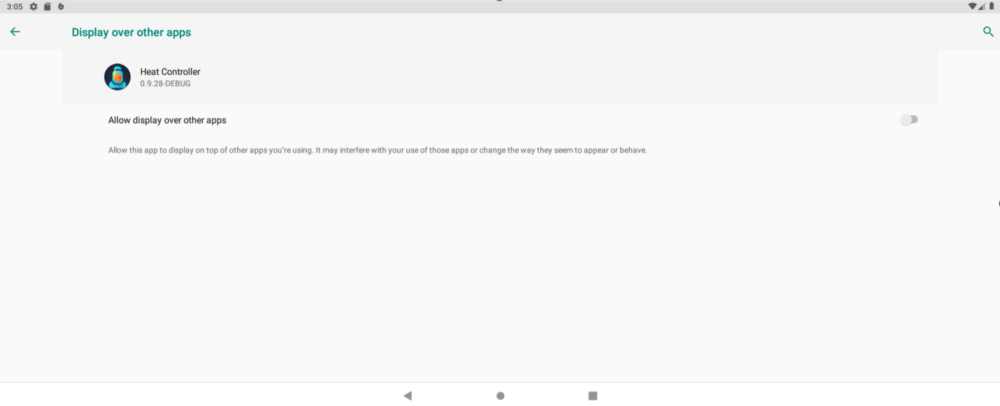]

Через настройки приложения необходимо выдать еще одно разрешение - на доступ к статистике приложений (также требуется для работы виджетов).

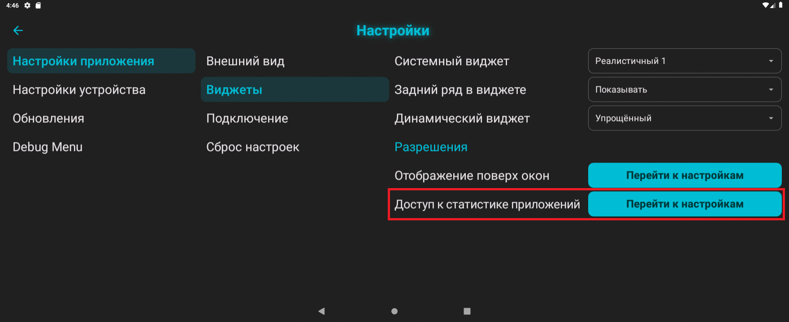

# 3. Главный экран приложения

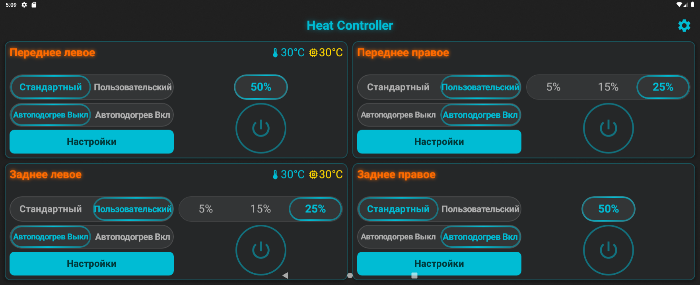

Главный экран приложения (дашборд) выполнен в виде четырех независимых блоков, содержащих элементы управления, текущее состояние и настройки каждого сиденья.

**Элементы индикации и управления:**
1. Название сиденья и текущая фактическая мощность нагревателя.
2. Индикатор температуры воздуха в салоне и температуры платы (для настройки автоподогрева необходимо ориентироваться именно на температуру воздуха в салоне).
3. Переключатель режимов "Стандартный"/"Пользовательский".
4. Переключатель уровней мощности.
5. Выключатель функции автоподогрева.
6. Кнопка "Настройки".
7. Кнопка-индикатор ручного включения нагрева.

## 3.1. Настройки сиденья
Кнопка "Настройки" открывает окно настроек нагревателя соответствующего сиденья.

> [!INFO] Сохранение настроек
> *Настройки сохраняются либо через 3 сек после изменений, либо при выходе из окна настроек.
> Изменения настроек автоподогрева (в том числе во время его работы) применяются только при следующем его включении.*

### 3.1.1. Пользовательский режим
Здесь можно настроить желаемую мощность для каждого из трех уровней подогрева в диапазоне от 5% до 100%.

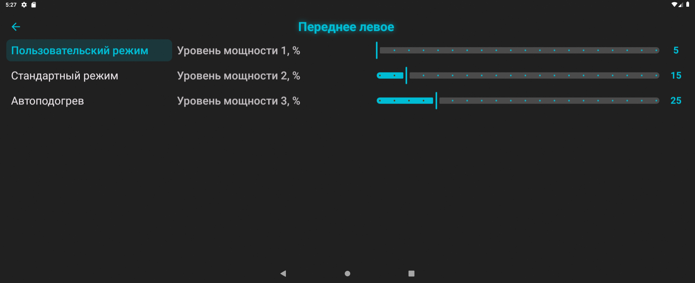

### 3.1.2. Стандартный режим
Здесь можно настроить желаемую мощность для единственного уровня подогрева в диапазоне от 5% до 100%.

### 3.1.3. Автоподогрев
Эта вкладка предназначена для настройки функции автоподогрева. Автоподогрев может работать в двух режимах "Умный" и "Расширенный".

#### 3.1.3.1. Умный режим

* **Диапазон температур** - это диапазон, в котором работает функция автоподогрева;
* **Диапазон длительности** - это диапазон значений времени прогрева, соответствующий диапазону установленному диапазону температур;
* **Мощность прогрева** - это мощность, с которой нагреватель будет прогревать сиденье при автоматическом включении;
* **Действие после прогрева** - это действие, которое автоматически выполнится по окончанию фазы прогрева.

> [!INFO] Прогрев
> *Прогрев - это фаза интенсивной работы нагревателя на повышенной мощности, целью которой является ускорение нагрева самого сиденья.*
> *Например, в соответствии с настроенными значениями на изображении автоподогрев может включаться при температуре от -30 до +10. При температуре -30 прогрев будет работать в течении 15 минут на мощности 90%, а при температуре +10 прогрев будет работать в течении 1 минуты на мощности 90%. После фазы прогрева нагреватель либо выключится, либо перейдет на мощность, установленную вручную, либо переключится на мощность, использованную в последней поездке. Если температура более +10 градусов, то автоподогрев уже не включится. Температура измеряется в момент запуска двигателя автомобиля.*

#### 3.1.3.2. Расширенный режим

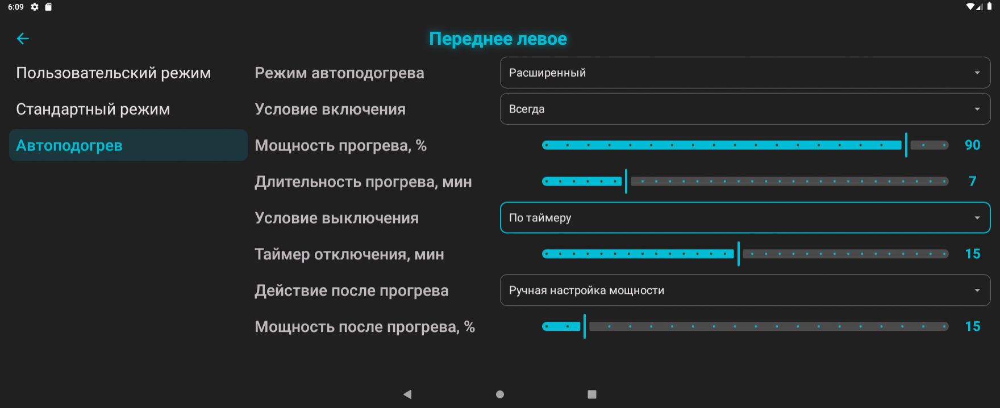

* **Условие включения** - либо включается всегда вне зависимости от температуры салона, либо включается только при температуре ниже установленной;
* **Мощность прогрева** - это мощность, с которой нагреватель будет прогревать сиденье при автоматическом включении;
* **Длительность прогрева** - это время работы нагревателя на повышенной мощности;
* **Условие выключения** - нагрев выключается либо по таймеру, либо по температуре, либо не выключается вообще;
* **Действие после прогрева** - это действие, которое автоматически выполнится по окончанию фазы прогрева.

> [!INFO] AUTO
> *При работающем автоподогреве на дашборде в блоках соответствующих сидений рядом с названием сиденья будет отображаться текст "[AUTO]" и оставшееся время работы автоподогрева (если это время ограничено настройками)*

# 4. Экран настроек

## 4.1. Настройки приложения

### 4.1.1. Основные
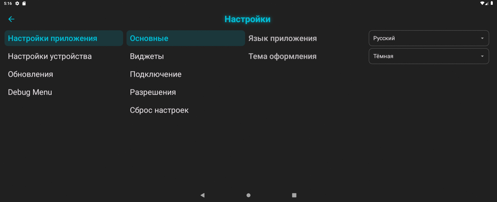

Здесь можно изменить язык приложения и тему оформления.

### 4.1.2. Виджеты
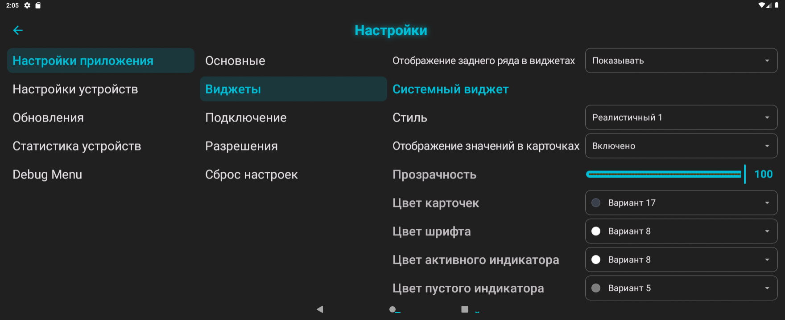

В этой вкладке расположены настройки виджетов приложения.
* **Задний ряд в виджете** - это настройка, позволяющая скрыть отображение сидений заднего ряда в виджетах (актуально тем, у кого только одна кастомная плата; если не скрывать задний ряд, то пиктограммы задних сидений всегда будут отображаться в полупрозрачном стиле, как неактивные);
* **Системный виджет** - это виджет текущего состояния подогревов, который подходит для отображения в главном окне системного лаунчера ГУ. Он не отображается поверх запущенных приложений. Имеет три варианта визуального оформления (Упрощенный / Реалистичный 1 / Реалистичный 2), а так же может быть полностью отключен;
* **Динамический виджет** - это виджет-уведомление, который отображается в течении трех секунд поверх всех запущенных приложений при нажатиях на кнопки подогрева. Имеет два варианта визуального оформления (Упрощенный / Реалистичный), а так же может быть полностью отключен;

 Для каждого виджета можно скрыть отображение числовых значений мощности.

### 4.1.3. Подключение
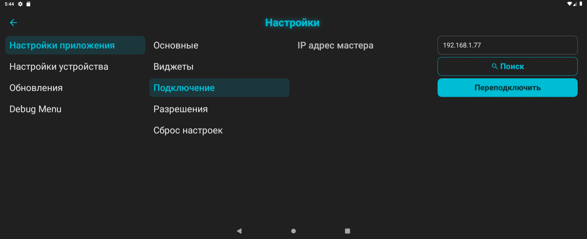

В этой вкладке реализована возможность ручного подключения к плате по IP-адресу.

> [!TODO]
> *Вероятно, раздел "Подключение" в будущем будет удален из приложения, так как оно автоматически находит плату в домашней сети, либо в режиме точки доступа по адресу 192.168.4.1.*

### 4.1.4. Разрешения
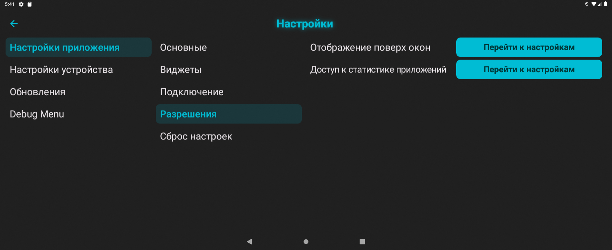
* **Отображение поверх окон и Доступ к статистике приложений** - это ссылки на системные настройки ГУ, где необходимо выдать разрешения для работы виджетов.

### 4.1.5. Сброс настроек
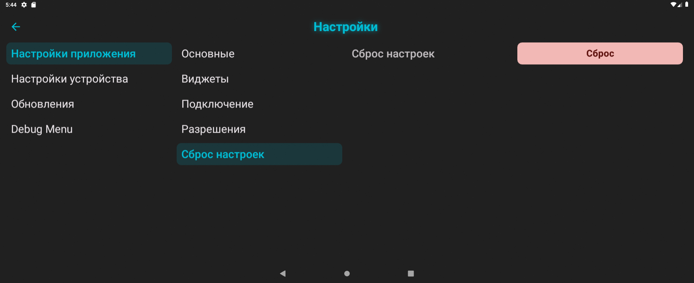

Кнопка "Сброс" поле подтверждения возвращает все настройки приложения к настройкам по умолчанию.

## 4.2. Настройки устройств

### 4.2.1. Система
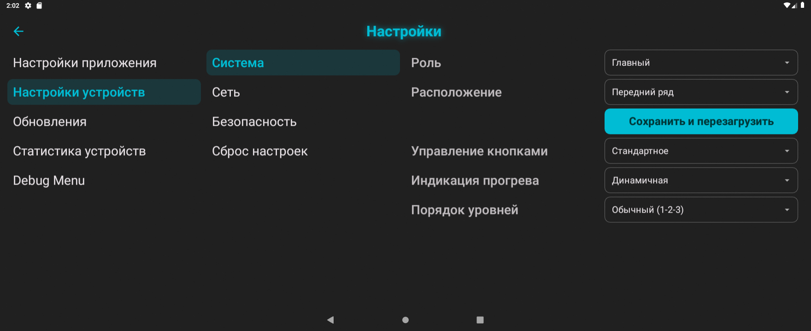

На данной вкладке можно изменить следующие параметры:
* **Роль** - настройка, которая позволяет назначить одну из плат в качестве главной (Master), а вторую в качестве ведомой (Slave). Актуально только при использовании двух плат.
* **Расположение** - это настройка, которая определяет расположение сидений этой платы на виджетах в зависимости от фактического расположения платы в автомобиле. Например, можно использовать одну плату для заднего ряда не смотря на то, что она может являться главной.

> [!WARNING] Важно
> *От параметров "Роль" и "Расположение" зависит базовый функционал прошивки, поэтому после их изменений необходимо нажать кнопку "Сохранить и перезагрузить"*

* **Управление кнопками** - этот параметр позволяет выбрать одну из схем управления физическими кнопкам включения подогревов.
	 **Стандартное:**
	 - всё управление осуществляется одиночными нажатиями по схеме "Первый уровень мощности -> Второй уровень мощности -> Третий уровень мощности -> Выкл" (в пользовательском режиме) и по схеме "Вкл -> Выкл" (в стандартном режиме)

	 **Альтернативное:**
	 - длинное нажатие включает/выключает нагрев;
	 - короткое одиночное нажатие включает первый уровень мощности;
	 - короткое двойное нажатие включает второй уровень мощности;
	 - короткое тройное нажатие включает третий уровень мощности.
- **Индикация прогрева** - изменение стиля светодиодной индикации в кнопках управления при прогреве.
- **Порядок уровней** - эта настройка позволяет реализовать соответствующую индикацию в карточках виджетов при переключении уровней нагрева от большего к меньшему (как в некоторых автомобилях VAG). То есть если в пользовательском (кастомном) режиме настроить уровни так, что первый уровень мощнее, чем второй и третий, и включить инвертированный порядок уровней, то при включении первого уровня в карточке виджета будет отображаться 3 активных индикатора, при включении первого уровня - 1 активный индикатор.

### 4.2.2. Сеть
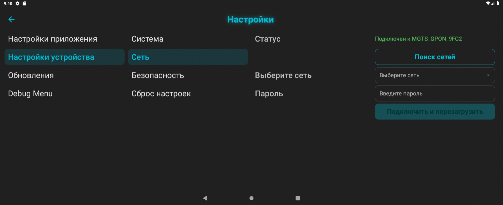

Данная вкладка предназначена для настройки подключения плат к домашней сети (не путать с системными настройками беспроводных сетей в ГУ!). Например, чтобы подключить плату к точке доступа мобильного телефона, нужно выполнить поиск сетей и выбрать нужную сеть в выпадающем списке, а затем ввести пароль. После этого плата перезагрузится и подключится к указанной сети WiFi, а в строке "Статус" будет отображаться имя этой самой сети.

### 4.2.3. Безопасность
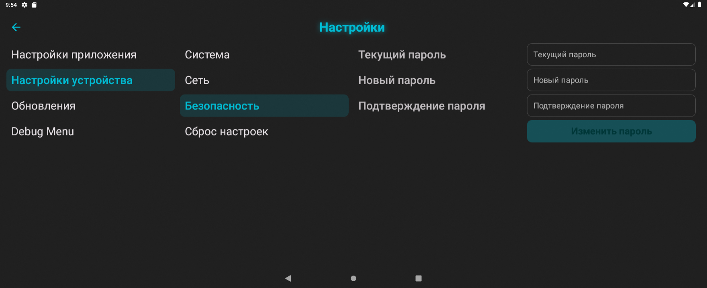

Настройки данной вкладки позволяют изменить пароль точки доступа плат. Для изменения пароля необходимо ввести текущий пароль, два раза ввести новый пароль и нажать кнопку "Изменить пароль".

> [!INFO] Пароль точки доступа
> *На всех платах пароль точки доступа по умолчанию "heat0000"*

### 4.2.4. Сброс настроек
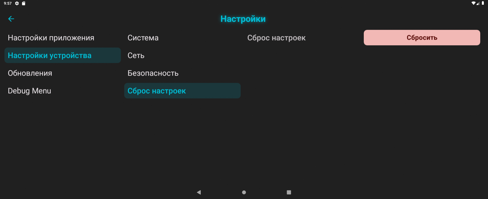

Нажатие кнопки "Сбросить" в данной вкладке приведет в восстановлению к заводским значениям всех настроек платы, кроме "Роль", "Расположение" и "Сеть".

### 4.2.5. Обновления

#### 4.2.5.1. Обновление приложения
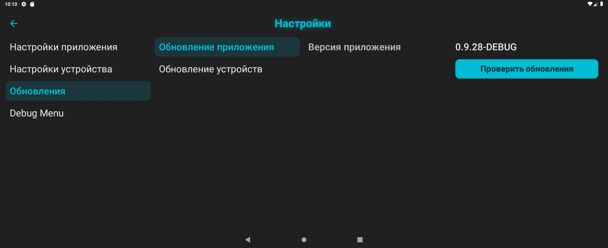

Наличие обновления для приложения проверяется автоматически при подключении к домашней сети WiFi с доступом к интернету, а также при нажатии на кнопку "Проверить обновления".

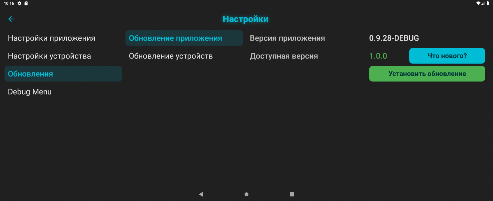

При наличии обновления появится кнопка "Что нового?" (описание изменений) и кнопка "Установить обновление", которая непосредственно запускает процесс скачивания apk-файла с сервера и его установки. При обновлении все настройки приложения и устройств сохраняются.

#### 4.2.5.2. Обновление устройств
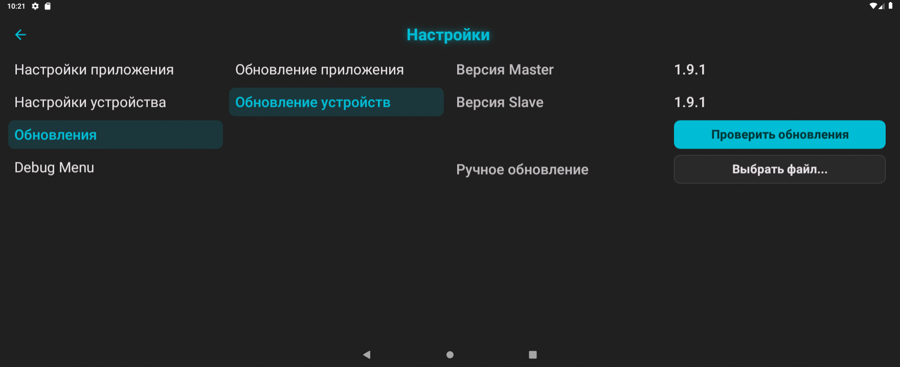

Если в автомобиле используются две платы, то в данной вкладке будет отображаться информация о версии главной платы (Master) и ведомой платы (Slave); если используется одна плата, то будет отображаться только информация о главной плате (Master).
Наличие обновления прошивки плат проверяется автоматически при подключении к домашней сети WiFi с доступом к интернету, а также при нажатии на кнопку "Проверить обновления".

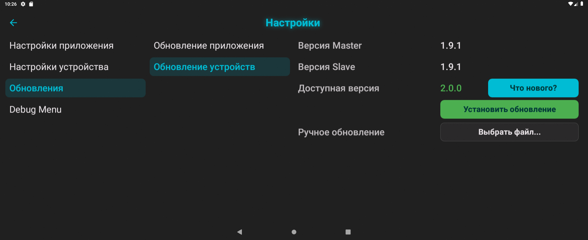

При наличии обновления появится кнопка "Что нового?" (описание изменений) и кнопка "Установить обновление", которая непосредственно запускает процесс скачивания bin-файла с сервера и его установки (если в автомобиле установлены две платы, то их прошивка обновится последовательно - сначала ведомая, затем главная). При обновлении все настройки приложения и устройств сохраняются.

При отсутствии возможности подключения к домашней сети WiFi с доступом в интернет есть возможность ручного обновления. Для этого необходимо выполнить следующее:
- скачать bin-файл прошивки заранее (там, где есть доступ в интернет);
- сохранить скачанный файл на флэшку;
- в автомобиле подключить флэшку в левый USB-разъем;
- на вкладке "Обновление устройств" нажать кнопку "Выбрать файл", через файловый менеджер найти нужный bin-файл и выбрать его;
- нажать кнопку "Установить обновление" - и начнется процесс обновления прошивки устройств, полностью аналогичный описанному выше.

### 4.2.6. Статистика устройств

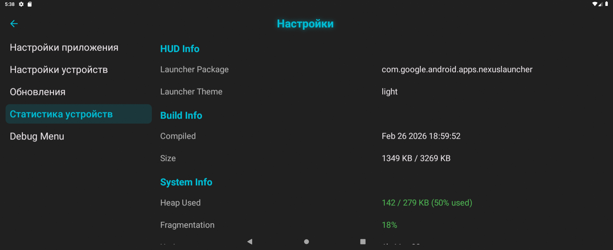

В этом разделе отображается системная информация о состоянии устройств.